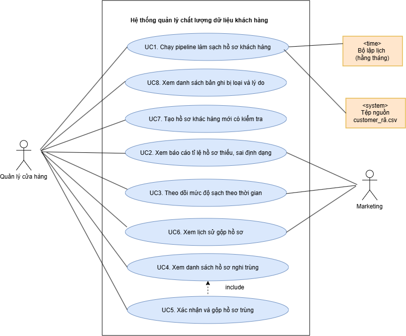

# SRS rút gọn : Luồng L7 "Chất lượng dữ liệu khách hàng"

- Sinh viên: KAYSONE Souk Anong – MSSV 237480201is05
- Môn: Chuyên đề tốt nghiệp 1 – Báo cáo buổi 4
- Track: DA

---

## Mục 1 – Bản SRS rút gọn

## 1. Giới thiệu và phạm vi

### 1.1. Bối cảnh doanh nghiệp

Mekong Mobile là chuỗi bán lẻ điện thoại có 24 cửa hàng và khoảng 65.000 khách hàng. Hồ sơ khách hàng nằm rải rác ở file Excel của từng cửa hàng, tin nhắn Zalo và sổ tay của trung tâm bảo hành. Theo case study, khoảng 18–22% hồ sơ bị trùng . Vì không tin danh sách, bộ phận Marketing phải gửi tin cho tất cả mọi người. Luồng L7 đo mức độ sạch của dữ liệu khách hàng, làm sạch và báo cáo cho người dùng.

### 1.2. Luồng nghiệp vụ đã chọn

Quản lý chất lượng dữ liệu khách hàng: hệ thống phát hiện hồ sơ trùng, thiếu và sai định dạng, chuẩn hóa số điện thoại và tên, gộp các hồ sơ được xác nhận trùng, và báo cáo mức độ sạch của dữ liệu theo thời gian. Dữ liệu dùng tệp mẫu customers_raw.csv (khoảng 65.000 bản ghi). Công nghệ: Python, pandas, SQLAlchemy, PostgreSQL, Streamlit.

### 1.3. Những chủ ý không làm (mức WON'T của MoSCoW)

- Không quản lý toàn bộ hệ thống Smart CRM của Mekong Mobile.

- Không quản lý bán hàng, đơn hàng và không xây kho dữ liệu doanh thu .

- Không phân khúc khách hàng và không dự báo khách rời bỏ .

- Không tiếp nhận, phân công hay theo dõi phiếu bảo hành; không quản lý kho linh kiện; không khảo sát hài lòng .

- Không đối sánh mờ bằng học máy trên toàn bộ 65.000 hồ sơ; chỉ dùng khóa so khớp cố định .

- Không tự động hoàn tác một lần gộp hồ sơ; chỉ ghi lịch sử để người dùng kiểm tra lại.

- Không sửa ngược file Excel hay hệ thống nguồn; không đăng nhập thật (vai trò chỉ mô phỏng trên dashboard).

### 1.4. Bảng thuật ngữ nghiệp vụ trong tài liệu

| **STT** | **Thuật ngữ**               | **Định nghĩa**                                                                                       | **Tên kỹ thuật**           |
|---------|-----------------------------|------------------------------------------------------------------------------------------------------|----------------------------|
| 1       | Hồ sơ khách hàng            | Bản ghi mô tả một khách hàng (họ tên, số điện thoại, email, địa chỉ, cửa hàng).                      | customer                   |
| 2       | Hồ sơ thô                   | Hồ sơ khách hàng đọc nguyên trạng từ customers_raw.csv, chưa xử lý.                                  | stg_customer               |
| 3       | Hồ sơ sạch                  | Hồ sơ khách hàng đã chuẩn hóa, có số điện thoại duy nhất.                                            | customer_clean             |
| 4       | Hồ sơ nghi trùng            | Các hồ sơ sạch có số điện thoại khác nhau nhưng nghi là cùng một khách , chờ xác nhận. | duplicate_review           |
| 5       | Lịch sử gộp                 | Nhật ký mỗi lần gộp hồ sơ: ai gộp, khi nào, hồ sơ nào vào hồ sơ nào.                                 | merge_log                  |
| 6       | Bản ghi bị loại             | Hồ sơ thô không chuẩn hóa được, được giữ lại kèm mã lý do.                                           | reject_customer            |
| 7       | Quy tắc chất lượng          | Điều kiện kiểm tra dữ liệu, có chiều chất lượng và ngưỡng.                                           | dq_rule (dim_dq_rule)      |
| 8       | Kết quả kiểm tra chất lượng | Số hồ sơ vi phạm và tỉ lệ đạt của một quy tắc trong một đợt chạy.                                    | dq_result (fact_dq_result) |
| 9       | Đợt chạy                    | Một lần chạy pipeline trên toàn bộ tệp nguồn.                                                        | run (dim_run)              |
| 10      | Điểm sạch                   | Trung bình tỉ lệ đạt của các quy tắc đang dùng trong một đợt chạy, ở giai đoạn CLEAN.                | —                          |
| 11      | RAW / CLEAN                 | Hai giai đoạn đo: trước và sau khi làm sạch.                                                         | stage                      |

## 2. Các bên liên quan và vai trò

| **Vai trò**                                  | **Nhiệm vụ**                                                                                                                                                                 | **Hạn chế**                                                                                                         |
|----------------------------------------------|------------------------------------------------------------------------------------------------------------------------------------------------------------------------------|---------------------------------------------------------------------------------------------------------------------|
| Quản lý cửa hàng                             | Chạy pipeline thủ công; tạo hồ sơ mới có kiểm tra; xem báo cáo, xu hướng, bản ghi bị loại, hồ sơ nghi trùng của cửa hàng mình; xác nhận gộp hồ sơ; xem số điện thoại đầy đủ. | Chỉ xem dữ liệu của cửa hàng mình ; không xóa vật lý hồ sơ ; không sửa quy tắc hay ngưỡng chất lượng. |
| Marketing                                    | Xem báo cáo, xu hướng và lịch sử gộp hồ sơ.                                                                                                                                  | Số điện thoại chỉ hiện dạng che ; không chạy pipeline; không xác nhận gộp.                                   |
| Bộ lập lịch (thời gian)                      | Kích hoạt đợt chạy định kỳ hằng tháng.                                                                                                                                       | Không xác nhận gộp, không xem dữ liệu.                                                                              |
| Tệp nguồn customers_raw.csv (hệ thống ngoài) | Cung cấp hồ sơ thô cho mỗi đợt chạy.                                                                                                                                         | Chỉ đọc, hệ thống không ghi ngược.                                                                                  |
| Khách hàng (bên liên quan gián tiếp)         | Không dùng hệ thống; là chủ thể của dữ liệu và được lợi khi không bị gửi tin trùng (V5).                                                                                     | Số điện thoại không bị lộ ngoài vai trò được phép; hồ sơ không bị xóa vật lý.                       |

## 3. Yêu cầu chức năng

### 3.1. User Story

| **Mã** | **User Story**                                                                                                                                                                              | **Vấn đề** | **MoSCoW** |
|--------|---------------------------------------------------------------------------------------------------------------------------------------------------------------------------------------------|------------|------------|
| US1    | Là Quản lý cửa hàng, tôi muốn số điện thoại khách hàng được chuẩn hóa về một định dạng thống nhất (10 chữ số bắt đầu bằng 0), để báo cáo và so sánh giữa các cửa hàng được chính xác.       | V1         | MUST       |
| US2    | Là Marketing, tôi muốn không bị tạo hồ sơ mới khi số điện thoại khách hàng đã tồn tại trong hệ thống, để tránh gửi trùng thông tin hoặc khuyến mãi cho cùng một khách hàng.                 | V1, V5     | SHOULD     |
| US3    | Là Quản lý cửa hàng, tôi muốn xem báo cáo tỉ lệ dữ liệu thiếu hoặc sai định dạng, để biết mức độ sạch của dữ liệu thuộc cửa hàng mình.                                                      | V1         | SHOULD     |
| US4    | Là Marketing, tôi muốn theo dõi mức độ sạch của dữ liệu theo thời gian, để đánh giá hiệu quả của việc làm sạch dữ liệu.                                                                     | V1, V5     | COULD      |
| US5    | Là Quản lý cửa hàng, tôi muốn xem danh sách hồ sơ khách hàng nghi trùng thuộc cửa hàng mình, để phát hiện sớm hồ sơ cần xử lý gộp.                                                          | V1         | MUST       |
| US6    | Là Quản lý cửa hàng, tôi muốn xác nhận gộp hai hồ sơ nghi trùng thành một hồ sơ duy nhất, để giữ lại đầy đủ lịch sử giao dịch của khách hàng, không mất dữ liệu khi báo cáo.                | V1         | MUST       |
| US7    | Là Marketing, tôi muốn xem lịch sử các lần gộp hồ sơ (ai gộp, khi nào, gộp hồ sơ nào vào hồ sơ nào), để kiểm tra lại nếu phát hiện gộp sai, tuân thủ QT-13 (không xóa vật lý).              | V1         | COULD      |
| US8    | Là Quản lý cửa hàng, tôi muốn được cảnh báo ngay khi tạo hồ sơ mới thiếu thông tin bắt buộc (ví dụ thiếu số điện thoại), để không sinh ra dữ liệu thiếu ngay từ đầu, giảm công sửa sau này. | V1         | SHOULD     |

### 3.2. Yêu cầu chức năng (FR)

| **Mã** | **Phát biểu (kiểm chứng được)**                                                                                                                                                                                                                                                                      | **US**   | **MoSCoW** |
|--------|------------------------------------------------------------------------------------------------------------------------------------------------------------------------------------------------------------------------------------------------------------------------------------------------------|----------|------------|
| FR1    | Hệ thống chuẩn hóa số điện thoại về 10 chữ số bắt đầu bằng 0 : bỏ ký tự không phải chữ số, đổi tiền tố 84 thành 0. Áp dụng khi nạp tệp và khi tạo hồ sơ mới. Số điện thoại không đủ 10 chữ số sau chuẩn hóa bị từ chối kèm mã lý do PHONE_INVALID.                                            | US1      | MUST       |
| FR2    | Khi số điện thoại đã chuẩn hóa đã tồn tại trong hồ sơ sạch, hệ thống không tạo hồ sơ mới mà hiển thị hồ sơ có sẵn . Khi nạp tệp, hồ sơ thô trùng được gắn vào hồ sơ có sẵn.                                                                                                                   | US2      | SHOULD     |
| FR3    | Khi tạo hồ sơ mới thiếu họ tên hoặc số điện thoại, hệ thống hiện cảnh báo ngay và không lưu. Khi nạp tệp, hồ sơ thiếu thông tin vào bản ghi bị loại kèm mã lý do (PHONE_MISSING, NAME_MISSING). Họ tên hợp lệ được chuẩn hóa: bỏ khoảng trắng thừa, viết hoa chữ cái đầu mỗi từ, giữ dấu tiếng Việt. | US8      | SHOULD     |
| FR4    | Mỗi đợt chạy, với từng quy tắc đang dùng và từng cửa hàng, hệ thống tính tổng số hồ sơ, số hồ sơ vi phạm và tỉ lệ đạt ở cả RAW và CLEAN, rồi lưu vào kết quả kiểm tra chất lượng.                                                                                                                    | US3, US4 | SHOULD     |
| FR5    | Hệ thống hiển thị báo cáo tỉ lệ hồ sơ thiếu và sai định dạng theo quy tắc cho đợt chạy được chọn; Quản lý cửa hàng chỉ thấy dữ liệu của cửa hàng mình. Báo cáo kèm danh sách bản ghi bị loại và lý do.                                                                                       | US3      | SHOULD     |
| FR6    | Hệ thống hiển thị biểu đồ xu hướng điểm sạch và tỉ lệ đạt từng quy tắc theo đợt chạy và theo ngày.                                                                                                                                                                                                   | US4      | COULD      |
| FR7    | Hệ thống liệt kê các nhóm hồ sơ nghi trùng thuộc cửa hàng của người dùng, theo thứ tự nhóm mới nhất trước.                                                                                                                                                                                           | US5      | MUST       |
| FR8    | Quản lý cửa hàng xác nhận gộp một nhóm nghi trùng: hệ thống giữ một hồ sơ chính, đánh dấu hồ sơ phụ ngừng sử dụng và ghi merged_into_id. Hồ sơ phụ không bị xóa vật lý, nên lịch sử của khách hàng vẫn truy ra được qua hồ sơ chính.                                                         | US6      | MUST       |
| FR9    | Mỗi lần gộp được ghi vào lịch sử gộp (người gộp, thời điểm, hồ sơ phụ, hồ sơ chính) và hiển thị trên dashboard.                                                                                                                                                                                      | US7      | COULD      |

### 3.3. Tiêu chí chấp nhận (Given–When–Then) cho story MUST

**US1 – Chuẩn hóa số điện thoại khách hàng**

- **AC1.1** – Given ba hồ sơ thô có số điện thoại lần lượt "+84 901 234 567", "84912345678" và "0923.456.789", When chạy pipeline, Then số điện thoại trong hồ sơ sạch lần lượt là "0901234567", "0912345678" và "0923456789" (QT-02).
- **AC1.2** *(ngoại lệ)* – Given hồ sơ thô có số điện thoại trống hoặc sau chuẩn hóa không đủ 10 chữ số (ví dụ "090123"), When chạy pipeline, Then hồ sơ vào bản ghi bị loại với mã lý do PHONE_MISSING hoặc PHONE_INVALID và không vào hồ sơ sạch.

**US5 – Xem danh sách hồ sơ nghi trùng**

- **AC5.1** – Given cửa hàng A có 3 nhóm nghi trùng đang chờ xác nhận và cửa hàng B có 2 nhóm, When Quản lý cửa hàng A mở danh sách, Then hệ thống chỉ hiển thị 3 nhóm của cửa hàng A, nhóm mới nhất ở trên cùng (QT-14).
- **AC5.2** *(ngoại lệ)* – Given cửa hàng A không có nhóm nghi trùng nào, When Quản lý cửa hàng A mở danh sách, Then hệ thống hiển thị "Không có hồ sơ nghi trùng" thay vì báo lỗi.
- **AC5.3** *(ngoại lệ)* – Given Quản lý cửa hàng A, When yêu cầu xem nhóm nghi trùng của cửa hàng B, Then hệ thống từ chối (QT-14) và không trả về dữ liệu.

**US6 – Xác nhận gộp hồ sơ nghi trùng**

- **AC6.1** – Given một nhóm nghi trùng đang chờ xác nhận gồm hồ sơ chính X và hồ sơ phụ Y, When Quản lý cửa hàng bấm "Xác nhận gộp", Then Y ngừng sử dụng và có merged_into_id trỏ về X, X giữ nguyên, nhóm chuyển sang CONFIRMED, và lịch sử gộp có thêm một dòng ghi người gộp, thời điểm, hồ sơ phụ, hồ sơ chính (BR-L7-05).
- **AC6.2** – Given nhóm đã được gộp xong, When truy vấn bảng hồ sơ sạch theo mã của Y, Then Y vẫn còn trong bảng, không bị xóa vật lý (QT-13).
- **AC6.3** *(ngoại lệ)* – Given hồ sơ phụ Y đã bị gộp bởi thao tác khác, When Quản lý cửa hàng bấm "Xác nhận gộp", Then hệ thống báo xung đột, không gộp và tải lại danh sách.

## 4. Yêu cầu phi chức năng (mọi yêu cầu có ngưỡng số)

| **Mã** | **Nhóm**            | **Yêu cầu và ngưỡng đo được**                                                                                                                                                                    | **Cách kiểm chứng**                           |
|--------|---------------------|--------------------------------------------------------------------------------------------------------------------------------------------------------------------------------------------------|-----------------------------------------------|
| NFR1   | Hiệu năng           | Pipeline xử lý toàn bộ khoảng 65.000 hồ sơ thô (từ đọc tệp đến nạp xong kho dữ liệu) trong dưới 5 phút trên máy 8 GB RAM, 4 nhân.                                                                | Đo từ started_at đến finished_at của đợt chạy |
| NFR2   | Tái lập             | Chạy lại pipeline 2 lần liên tiếp trên cùng tệp nguồn thì số dòng của hồ sơ sạch, bản ghi bị loại và hồ sơ nghi trùng chênh lệch 0 dòng.                                                         | So sánh COUNT(\*) sau lần 1 và lần 2          |
| NFR3   | Chất lượng đầu ra   | Trong hồ sơ sạch: 100% số điện thoại khớp ^0\[0-9\]{9}\$; 0 số điện thoại trùng; 0% thiếu số điện thoại. Số hồ sơ đọc = hồ sơ mới + hồ sơ gắn vào hồ sơ có sẵn + bản ghi bị loại (chênh lệch 0). | COUNT, COUNT DISTINCT, regex                  |
| NFR4   | Hiệu năng dashboard | Mỗi trang dashboard tải xong trong 3 giây hoặc ít hơn với tối đa 10.000 dòng kết quả kiểm tra và 100.000 dòng vi phạm.                                                                           | Đo thời gian chạy trang                       |
| NFR5   | Riêng tư            | 100% số điện thoại hiển thị cho Marketing ở dạng che (ví dụ 090567); 0 số đầy đủ trong dữ liệu trả về cho vai trò này (QT-15).                                                                   | Kiểm tra tự động trên view masked             |
| NFR6   | Truy vết            | 100% bản ghi bị loại có mã lý do khác rỗng và gắn với một đợt chạy.                                                                                                                              | COUNT WHERE reason_code IS NULL = 0           |
| NFR7   | Phạm vi dữ liệu     | 100% dòng trả về cho Quản lý cửa hàng thuộc cửa hàng của họ; 0 dòng của cửa hàng khác (QT-14).                                                                                                   | Kiểm tra tự động theo store_key               |
| NFR8   | Phản hồi khi nhập   | Cảnh báo thiếu thông tin bắt buộc hiện trong 1 giây hoặc ít hơn sau khi bấm Lưu.                                                                                                                 | Đo thời gian phản hồi của form                |

## 5. Use Case

### 5.1. Danh sách use case

| Mã | Use case | Actor | US liên quan |
|---|---|---|---|
| UC1 | Chạy pipeline làm sạch hồ sơ khách hàng | Quản lý cửa hàng, Bộ lập lịch, Tệp nguồn | US1, US2, US8 |
| UC2 | Xem báo cáo tỉ lệ hồ sơ thiếu, sai định dạng | Quản lý cửa hàng, Marketing | US3 |
| UC3 | Theo dõi mức độ sạch theo thời gian | Quản lý cửa hàng, Marketing | US4 |
| UC4 | Xem danh sách hồ sơ nghi trùng | Quản lý cửa hàng | US5 |
| UC5 | Xác nhận và gộp hồ sơ trùng (include UC4) | Quản lý cửa hàng | US6 |
| UC6 | Xem lịch sử gộp hồ sơ | Quản lý cửa hàng, Marketing | US7 |
| UC7 | Tạo hồ sơ khách hàng mới có kiểm tra | Quản lý cửa hàng | US1, US2, US8 |
| UC8 | Xem danh sách bản ghi bị loại và lý do | Quản lý cửa hàng | US3, US8 |

### 5.2. Use Case Diagram

### 5.2. Use Case Diagram

*Hình 5.1 – Use Case Diagram của luồng L7.*

### 5.3. Đặc tả chi tiết UC1 – Chạy pipeline làm sạch hồ sơ khách hàng

| Mục | Nội dung |
|---|---|
| Actor | Quản lý cửa hàng (hoặc Bộ lập lịch). Actor phụ: Tệp nguồn customers_raw.csv |
| Mục tiêu | Biến hồ sơ thô thành hồ sơ sạch, đo chất lượng RAW và CLEAN, cập nhật kho dữ liệu |
| Liên quan | US1, US2, US8; FR1, FR2, FR3, FR4 |
| Điều kiện trước | Tệp customers_raw.csv có trong thư mục data/; PostgreSQL đang chạy và kết nối được |
| Điều kiện sau (thành công) | Hồ sơ sạch có số điện thoại duy nhất. Số hồ sơ đọc = hồ sơ mới + hồ sơ gắn vào hồ sơ có sẵn + bản ghi bị loại. Đợt chạy có trạng thái SUCCESS |

**Luồng chính**

1. Actor kích hoạt pipeline (lệnh make run hoặc lịch hằng tháng).
2. Hệ thống tạo đợt chạy và ghi giờ bắt đầu.
3. Hệ thống đọc tệp nguồn, nạp nguyên trạng vào hồ sơ thô và đối soát số dòng.
4. Hệ thống đo các quy tắc chất lượng ở giai đoạn RAW.
5. Hệ thống chuẩn hóa số điện thoại (QT-02) và họ tên.
6. Hệ thống đối chiếu số điện thoại với hồ sơ sạch; nếu chưa có thì thêm hồ sơ mới.
7. Hệ thống tìm các nhóm hồ sơ nghi trùng (BR-L7-04) và ghi trạng thái PENDING.
8. Hệ thống đo các quy tắc ở giai đoạn CLEAN và nạp kết quả vào kho dữ liệu.
9. Hệ thống ghi giờ kết thúc và hiển thị tóm tắt (số đọc, sạch, bị loại, nghi trùng, thời gian).

**Luồng ngoại lệ (đánh số theo bước)**

- **3a** – Tệp không có hoặc thiếu cột bắt buộc: dừng, ghi FAILED, báo rõ cột thiếu, không đổi bảng đích.
- **3b** – Số dòng nạp khác số dòng của tệp: hủy transaction, ghi FAILED.
- **5a** – Số điện thoại thiếu hoặc không đủ 10 chữ số: ghi vào bản ghi bị loại (PHONE_MISSING hoặc PHONE_INVALID), tiếp tục với hồ sơ khác.
- **6a** – Số điện thoại đã có (QT-01), kể cả khi chạy lại: không tạo hồ sơ mới, gắn hồ sơ thô vào hồ sơ có sẵn.
- **8a** – Mất kết nối cơ sở dữ liệu khi nạp kho dữ liệu: hủy toàn bộ transaction của đợt chạy, ghi FAILED.

### 5.4. Đặc tả chi tiết UC5 – Xác nhận và gộp hồ sơ trùng

| Mục | Nội dung |
|---|---|
| Actor | Quản lý cửa hàng |
| Mục tiêu | Hợp nhất các hồ sơ được xác nhận là cùng một khách hàng, không xóa vật lý (QT-13) |
| Liên quan | US6; FR8 |
| Điều kiện trước | Có ít nhất một nhóm nghi trùng trạng thái PENDING thuộc cửa hàng của người dùng |
| Điều kiện sau (thành công) | Hồ sơ phụ có is_active = false và merged_into_id trỏ về hồ sơ chính. Nhóm có trạng thái CONFIRMED. Lịch sử gộp có thêm một dòng (BR-L7-05) |

**Luồng chính**

1. Actor mở danh sách hồ sơ nghi trùng (include UC4).
2. Actor chọn một nhóm.
3. Hệ thống hiển thị các hồ sơ trong nhóm cạnh nhau và đề xuất hồ sơ chính (created_at sớm nhất).
4. Actor bấm "Xác nhận gộp".
5. Hệ thống gộp: đánh dấu hồ sơ phụ ngừng sử dụng, ghi merged_into_id, cập nhật trạng thái nhóm.
6. Hệ thống ghi lịch sử gộp và làm mới danh sách.

**Luồng ngoại lệ (đánh số theo bước)**

- **4a** – Actor bấm "Không trùng": nhóm chuyển REJECTED và không xuất hiện lại ở các đợt chạy sau.
- **5a** – Hồ sơ phụ đã bị gộp bởi thao tác khác: không gộp, báo xung đột và tải lại danh sách.

## 6. Ràng buộc và quy tắc nghiệp vụ

| Mã | Quy tắc | Nguồn | FR |
|---|---|---|---|
| QT-01 | Số điện thoại khách hàng là duy nhất; số đã tồn tại thì hiển thị hồ sơ có sẵn thay vì tạo hồ sơ mới. | Bảng 9.1 | FR2 |
| QT-02 | Số điện thoại chuẩn hóa về 10 chữ số bắt đầu bằng 0; các dạng +84…, 84…, dấu cách, dấu chấm đều quy về dạng chuẩn. | Bảng 9.1 | FR1 |
| QT-13 | Không xóa vật lý hồ sơ khách hàng; chỉ đánh dấu ngừng sử dụng và giữ lịch sử. | Bảng 9.1 | FR8, FR9 |
| QT-14 | Nhân viên chỉ xem dữ liệu của nơi mình làm việc; quản lý xem toàn bộ đơn vị mình phụ trách. | Bảng 9.1 | FR5, FR7 |
| QT-15 | Số điện thoại hiển thị dạng che với mọi vai trò trừ Quản lý và Ban giám đốc. | Bảng 9.1 | FR5, FR9 |
| BR-L7-01 | Pipeline không tự gộp hồ sơ có số điện thoại khác nhau; chỉ gộp sau khi Quản lý cửa hàng xác nhận. | Phân tích của SV | FR8 |
| BR-L7-02 | Hồ sơ thô không chuẩn hóa được không bị xóa mà vào bản ghi bị loại kèm mã lý do. | Phân tích của SV | FR1, FR3 |
| BR-L7-03 | Ngưỡng chất lượng chỉ được chốt sau khi đo tỉ lệ lỗi RAW trên dữ liệu thật. | Phân tích của SV | FR4 |
| BR-L7-04 | Hai hồ sơ sạch là nghi trùng khi số điện thoại khác nhau nhưng trùng email (không rỗng, không phân biệt hoa thường), HOẶC trùng đồng thời họ tên không dấu đã chuẩn hóa và địa chỉ đã chuẩn hóa. | Phân tích của SV | FR7 |
| BR-L7-05 | Mỗi lần gộp phải ghi người gộp, thời điểm, hồ sơ phụ và hồ sơ chính. | Phân tích của SV | FR9 |

## 7. Bảng truy vết yêu cầu

**Truy vết yêu cầu chức năng**

| FR | User Story | Use Case | MoSCoW |
|---|---|---|---|
| FR1 | US1 | UC1, UC7 | MUST |
| FR2 | US2 | UC1, UC7 | SHOULD |
| FR3 | US8 | UC1, UC7, UC8 | SHOULD |
| FR4 | US3, US4 | UC1, UC2 | SHOULD |
| FR5 | US3 | UC2, UC8 | SHOULD |
| FR6 | US4 | UC3 | COULD |
| FR7 | US5 | UC4 | MUST |
| FR8 | US6 | UC5 | MUST |
| FR9 | US7 | UC6 | COULD |

**Truy vết yêu cầu phi chức năng**

| NFR | FR liên quan | MoSCoW |
|---|---|---|
| NFR1 | FR1, FR2, FR3, FR4 | SHOULD |
| NFR2 | FR1, FR2, FR4, FR8 | MUST |
| NFR3 | FR1, FR2 | MUST |
| NFR4 | FR5, FR6, FR7, FR9 | SHOULD |
| NFR5 | FR2, FR5, FR9 | MUST |
| NFR6 | FR1, FR3 | SHOULD |
| NFR7 | FR5, FR7 | MUST |
| NFR8 | FR3 | SHOULD |

